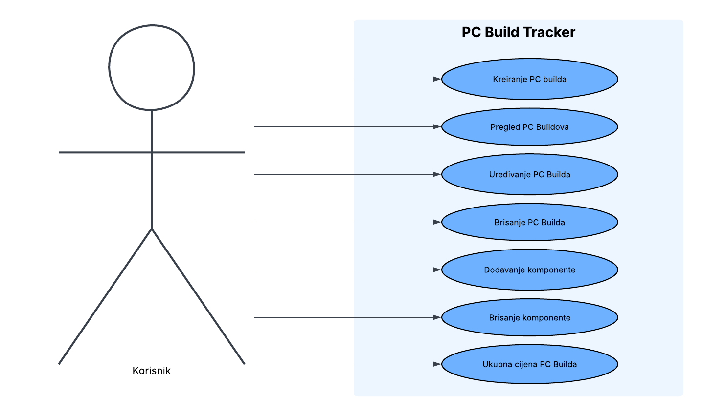

# PC Build Tracker

Web aplikacija za konfiguraciju i praćenje odabira PC komponenti u svrhu planiranja kupnje računalne konfiguracije.

Korisnik može kreirati više "buildova" (konfiguracija računala), svakom dodavati komponente (CPU, GPU, RAM, itd.) uz cijenu i proizvođača, te pratiti ukupnu cijenu build-a u stvarnom vremenu.

## Usecase dijagram



## Funkcionalnosti

- Kreiranje, pregled, uređivanje i brisanje PC builda
- Dodavanje i brisanje komponenti unutar builda
- Automatski izračun ukupne cijene builda i raspodjele troška po kategoriji komponenti
- REST API (JSON) s odvojenim frontendom koji ga koristi preko `fetch`-a

## Tehnologije

- Python / Flask
- PonyORM + SQLite
- HTML / Bootstrap 5 / vanilla JavaScript
- Docker / Docker Compose

## Pokretanje lokalno (Docker)

```bash
git clone <URL_repoa>
cd pc_build_tracker
docker compose up --build
```

Aplikacija je dostupna na [http://localhost:5000](http://localhost:5000).

## Pokretanje lokalno (bez Dockera)

```bash
python -m venv .venv
source .venv/bin/activate   # Windows: .venv\Scripts\activate
pip install -r requirements.txt
python app.py
```

## API rute

| Metoda | Putanja | Opis |
|---|---|---|
| GET | `/api/buildovi` | Lista svih buildova |
| POST | `/api/buildovi` | Kreiranje novog builda |
| GET | `/api/buildovi/<id>` | Detalji builda s komponentama |
| PUT | `/api/buildovi/<id>` | Uređivanje builda |
| DELETE | `/api/buildovi/<id>` | Brisanje builda |
| POST | `/api/buildovi/<id>/komponente` | Dodavanje komponente |
| DELETE | `/api/komponente/<id>` | Brisanje komponente |
| GET | `/api/buildovi/<id>/ukupna-cijena` | Ukupna cijena i raspodjela po kategoriji |
| GET | `/api/kategorije` | Popis dopuštenih kategorija komponenti |
